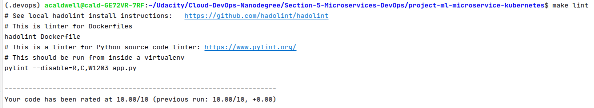
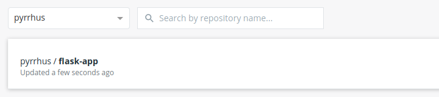
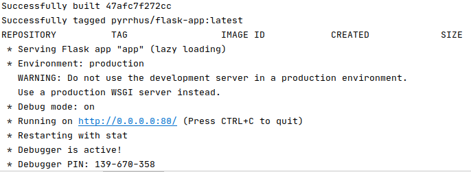
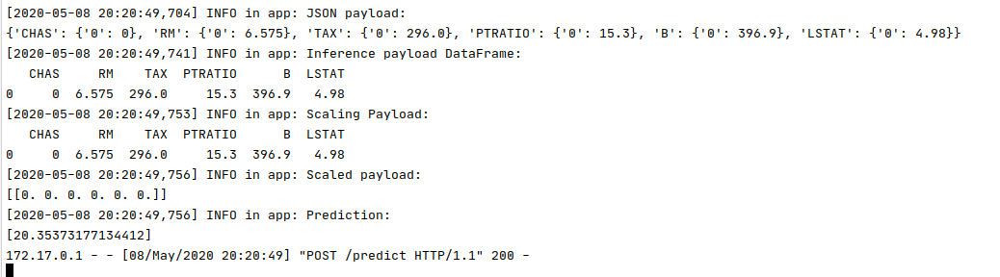
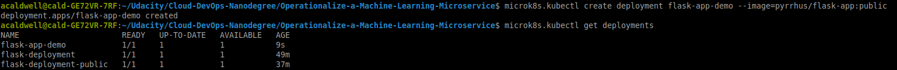
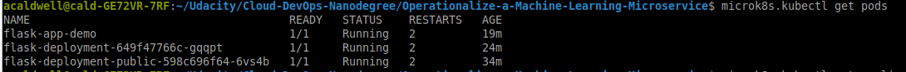
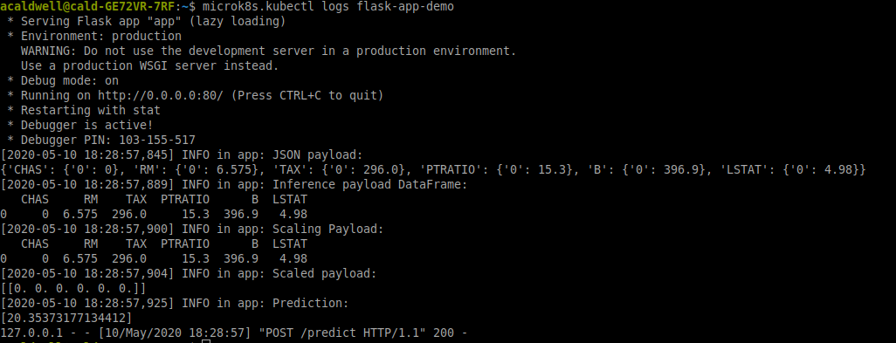

# Project Overview

In this project, you will apply the skills you have acquired in this course to operationalize a Machine Learning Microservice API. 

You are given a pre-trained, `sklearn` model that has been trained to predict housing prices in Boston according to several features, such as average rooms in a home and data about highway access, teacher-to-pupil ratios, and so on. You can read more about the data, which was initially taken from Kaggle, on [the data source site](https://www.kaggle.com/c/boston-housing). This project tests your ability to operationalize a Python flask app—in a provided file, `app.py`—that serves out predictions (inference) about housing prices through API calls. This project could be extended to any pre-trained machine learning model, such as those for image recognition and data labeling.

### Project Tasks

Your project goal is to operationalize this working, machine learning microservice using [kubernetes](https://kubernetes.io/), which is an open-source system for automating the management of containerized applications. In this project you will:

* Test your project code using linting
* Complete a Dockerfile to containerize this application
* Deploy your containerized application using Docker and make a prediction
* Improve the log statements in the source code for this application
* Configure Kubernetes and create a Kubernetes cluster
* Deploy a container using Kubernetes and make a prediction
* Upload a complete Github repo with CircleCI to indicate that your code has been tested

You can find a detailed [project rubric, here](https://review.udacity.com/#!/rubrics/2576/view).

**The final implementation of the project will showcase your abilities to operationalize production microservices.**

---

## Setup the Environment

* Create a virtualenv and activate it

* Run `make install` to install the necessary dependencies

Make install will also check for lint, note: Please make sure to install pylint or add pylint to the requirements.txt file.

Hadolint will be running to check your files.

### Running `app.py`

1. Standalone:  `python app.py`
2. Run in Docker:  `./run_docker.sh`
3. Run `./update_docker.sh` once you updated the file, such as the tag name

You can push the image to Docker, which will show up on Docker Hub

Once you published the image, you can run `./make_prediction.sh` and it will output this info.

4. Run in Kubernetes:  `./run_kubernetes.sh`

### Kubernetes Steps

* Setup and Configure Docker locally
* Setup and Configure Kubernetes locally (note: I am using microk8S)
* Create Flask app in Container
* Run via kubectl

You will need to create the deployment for the app, and then expose the app to port 80.

Once it is exposed, make sure to get all of the pods to makes sure that it is running.

To see the list of the pods, see screenshot

Aftewards, port-forward the port 8000:80, where the pod is listening at 80. You will need to forward the port 80 to 8000 because this is where the make_prediction.sh file is listening for the port at.

Here is the screenshot of the log for the pod once the app is running.

